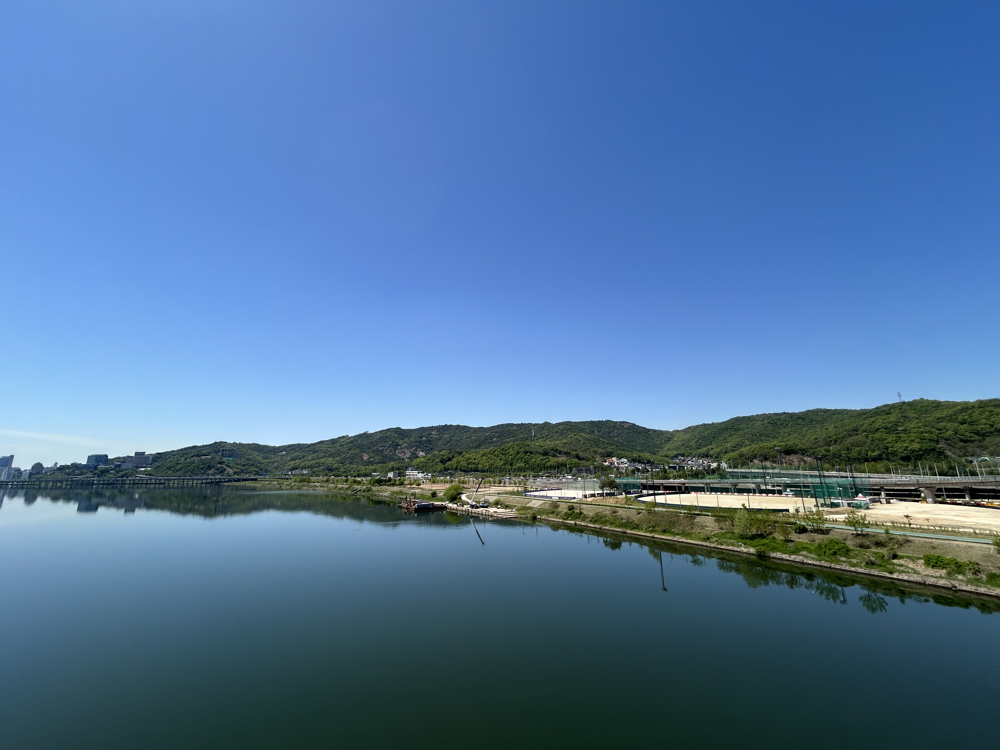
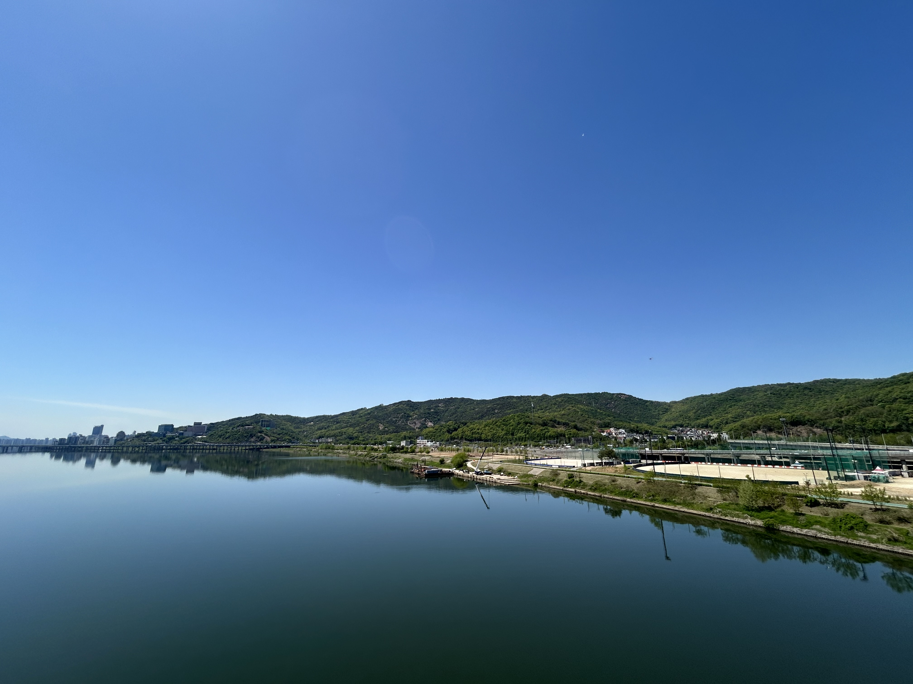
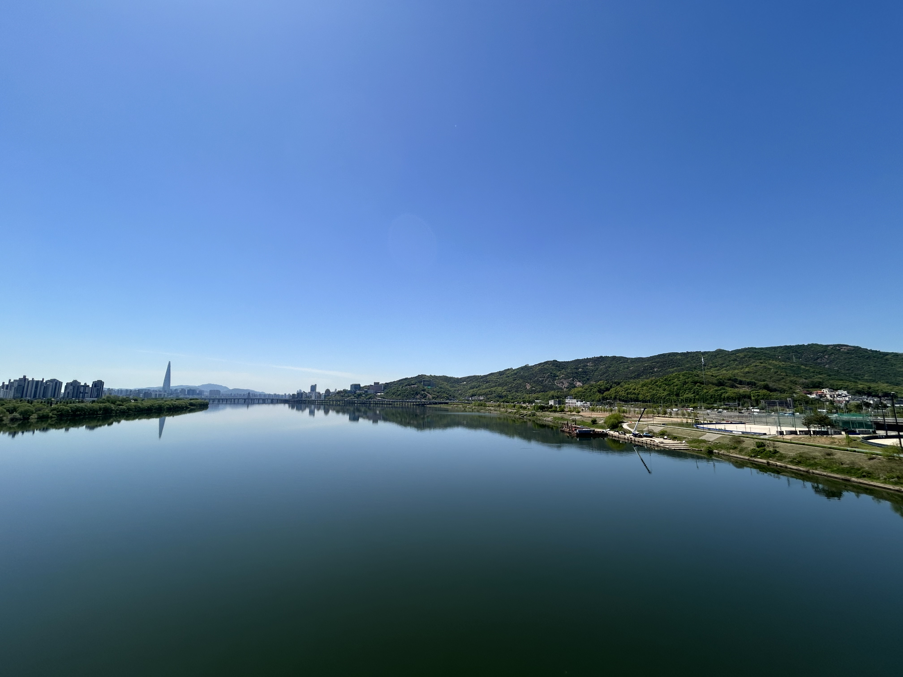

# OpenCV Image Stitcher

이미지를 자동으로 수집해서 하나의 파노라마 이미지로 합치는 프로그램입니다. 특징점 추출, 매칭, 호모그래피 추정, 워핑, 블렌딩을 직접 구성했습니다.

## 기능

- `data/` 하위의 이미지를 재귀적으로 탐색해 자동 입력 처리
- ORB 특징점 추출 및 BFMatcher 기반 매칭
- RANSAC 기반 호모그래피 추정
- 이미지 연결 그래프 구성 후 전역 좌표계로 정합
- `warpPerspective`를 이용한 캔버스 합성
- 거리변환 기반 feather 블렌딩으로 경계 seam 완화
- 결과 이미지를 `output/panorama.jpg`로 저장

## 실행 방법

1. 이미지를 `data/` 폴더에 넣습니다.
2. 아래 명령으로 실행합니다.

```powershell
python.exe .\main.py
```

3. 생성된 결과는 `output/panorama.jpg`에서 확인할 수 있습니다.

## 실행 결과

아래는 현재 프로젝트에 들어있는 입력 이미지 예시와 실행 결과입니다.

### 입력 이미지

| 1 | 2 | 3 |
|---|---|---|
|  |  |  |

### 출력 이미지

| Panorama |
|---|
|  |

## 참고

- 입력 이미지들의 겹침 영역이 충분해야 정합 품질이 안정적입니다.
- 사진 간 시차가 크거나 촬영 각도가 과하게 다르면 일부 구간이 왜곡될 수 있습니다.
- 필요하면 원통형/구면 투영, 멀티밴드 블렌딩, 매칭 검증 강화도 추가할 수 있습니다.